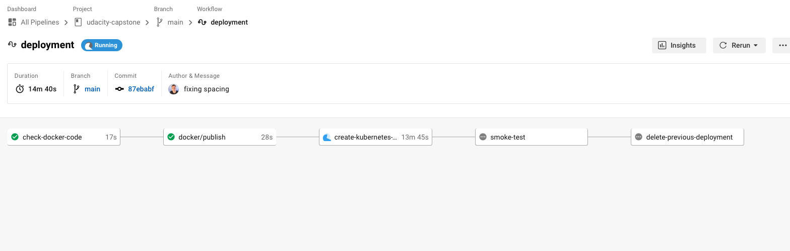

## Udacity Capstone Project - NGINX Application Deployment pipeline

This repo carries out the following tasks :  

- Lints the Docker and HTML files prior to Image Build 
- Uploads Image to docker hub  
- Deploys a EKS cluster within AWS and deploys the newly built container image into Kubernetes 
- Smoke test to confirm site is avalible.
- Deletes previous infrasturcute deployment.

### Screenshot Submission

- 
  1. Example of failed LINT due to errors in the code [screenshots/screenshot-lint-fail.png]
  2. Example of Passed LINT with no errors in the code [screenshots/screenshot-lint-fail.png]
  3. Example of Working deployment NGINX Site [screenshots/screenshot-nginx.png]

### Built With

- [Circle CI](www.circleci.com) - Cloud-based CI/CD service
- [Circle CI Orbs](https://circleci.com/developer/orbs/orb/circleci/docker) - Circle CI Orbs 
- [Amazon AWS](https://aws.amazon.com/) - Cloud services
- [AWS CLI](https://aws.amazon.com/cli/) - Command-line tool for AWS
- [CloudFormation](https://aws.amazon.com/cloudformation/) - Infrastrcuture as code
- [Ansible](https://www.ansible.com/) - Configuration management tool
